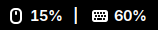
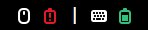
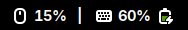
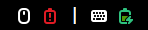
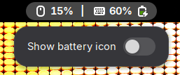

# Logi Battery Indicator

[](https://github.com/hornc-greedy/logi-battery/releases)
[](LICENSE)

A GNOME Shell extension that shows battery percentage and charging status in
the top bar for input devices such as the Logitech MX Master and MX Keys

- Shows battery percentage and charging status per device in the top bar
- Works over a Unifying/Bolt receiver or direct Bluetooth pairing
- No Solaar or other companion app required

Percentage mode:



Icon mode (colored by charge level):



Charging:




Settings menu:



## Requirements

- GNOME Shell 50
- Logitech devices connected either through a Unifying/Bolt receiver, or
  paired directly over Bluetooth

## How it works

- Talks HID++ 2.0 directly to each device's `/sys/class/hidraw` interface
- No Solaar, no UPower, no separate daemon in between
- Event-driven, not polled - no fixed refresh interval
- Panel updates whenever a device pushes its own battery-status or
  connect/disconnect notification

## Features

- Battery percentage per device in the panel, with a device-type icon
- Charging indicator
- Updates instantly on the device's own battery/connect events, no polling
- Settings in the panel menu:
  - **Show battery icon** - switch between the percentage and a battery
    icon colored red / yellow / green by charge level

## Installation

```sh
git clone https://github.com/hornc-greedy/logi-battery.git
cp -r logi-battery ~/.local/share/gnome-shell/extensions/logi-battery@hornc-greedy.github.io
glib-compile-schemas ~/.local/share/gnome-shell/extensions/logi-battery@hornc-greedy.github.io/schemas/
gnome-extensions enable logi-battery@hornc-greedy.github.io
```

Log out and back in (Wayland)

## Development

Symlink instead of copying, then reload after each change:

```sh
ln -s "$(pwd)" ~/.local/share/gnome-shell/extensions/logi-battery@hornc-greedy.github.io
glib-compile-schemas ~/.local/share/gnome-shell/extensions/logi-battery@hornc-greedy.github.io/schemas/
gnome-extensions disable logi-battery@hornc-greedy.github.io && gnome-extensions enable logi-battery@hornc-greedy.github.io
```

Log out and back in (Wayland)

## Support & device compatibility

Should work with any Logitech device speaking HID++ 2.0, wired or Bluetooth.
If something doesn't work, open an issue at
<https://github.com/hornc-greedy/logi-battery/issues> with the device model.

## License

GPL-2.0-or-later. See [LICENSE](LICENSE).
