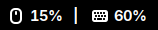
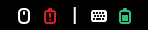
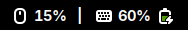
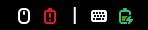
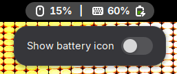

# Logi Battery Indicator

[](https://github.com/hornc-greedy/logi-battery/releases)
[](LICENSE)

A GNOME Shell extension that shows battery percentage and charging status in
the top bar for input devices such as the Logitech MX Master and MX Keys

- Shows battery percentage and charging status per device in the top bar
- Works over a Unifying/Bolt receiver or direct Bluetooth pairing
- No Solaar or other companion app required

Percentage mode:



Icon mode (colored by charge level):



Charging:




Settings menu:



## Requirements

- GNOME Shell 50
- Logitech devices connected either through a Unifying/Bolt receiver, or
  paired directly over Bluetooth
- A Bolt receiver on Linux before 7.3 needs the udev rule from the
  installation section

## How it works

- Reads batteries from UPower over D-Bus, which gets them from the
  kernel's HID++ driver
- Talks HID++ 2.0 directly to a Bolt receiver on Linux before 7.3,
  since the kernel only drives it from 7.3 on
- No Solaar, no separate daemon in between
- Event-driven, not polled - no fixed refresh interval
- Panel updates whenever a device pushes its own battery-status or
  connect/disconnect notification

## Features

- Battery percentage per device in the panel, with a device-type icon
- Charging indicator
- Updates instantly on the device's own battery/connect events, no polling
- Settings in the panel menu:
  - **Show battery icon** - switch between the percentage and a battery
    icon colored red / yellow / green by charge level

## Installation

```sh
git clone https://github.com/hornc-greedy/logi-battery.git
cp -r logi-battery ~/.local/share/gnome-shell/extensions/logi-battery@hornc-greedy.github.io
glib-compile-schemas ~/.local/share/gnome-shell/extensions/logi-battery@hornc-greedy.github.io/schemas/
gnome-extensions enable logi-battery@hornc-greedy.github.io
```

Log out and back in (Wayland)

### Bolt receiver on Linux before 7.3

The extension reads the receiver's HID++ interface directly and needs a
udev rule for access. Install it once from the repository:

```sh
sudo cp udev/70-logi-battery-bolt.rules /etc/udev/rules.d/
sudo udevadm control --reload
sudo udevadm trigger --subsystem-match=hidraw
```

## Development

Symlink instead of copying, then reload after each change:

```sh
ln -s "$(pwd)" ~/.local/share/gnome-shell/extensions/logi-battery@hornc-greedy.github.io
glib-compile-schemas ~/.local/share/gnome-shell/extensions/logi-battery@hornc-greedy.github.io/schemas/
gnome-extensions disable logi-battery@hornc-greedy.github.io && gnome-extensions enable logi-battery@hornc-greedy.github.io
```

Log out and back in (Wayland)

## Support & device compatibility

The panel shows every Logitech device whose battery the kernel's
`hid-logitech-hidpp` driver reports. The tables follow the driver tables of
Linux 7.3. Devices marked 7.3 need that kernel.

### Receivers

Any device that reports its battery to one of these receivers

| Receiver | USB ID |
| --- | --- |
| Unifying | `c52b`, `c532` |
| Bolt | `c548` (7.3, earlier with the udev rule above) |
| Nano | `c52f`, `c534` |
| Lightspeed | `c539`, `c53f`, `c543`, `c547`, `c54d`, `c545` (7.3) |
| Powerplay | `c53a` |
| G700(s), G602 | `c531`, `c537` |
| 27 MHz | `c513`, `c517`, `c51b` |
| MX5000, MX5500, diNovo Edge, diNovo Mini | `c70a`, `c70e`, `c71b`, `c71c`, `c713`, `c714`, `c71e`, `c71f` |

### Bluetooth

| Device | Bluetooth ID |
| --- | --- |
| MX Master, 2S, 3, 3S, 4 | `b012`, `b019`, `b023`, `b034`, `b042` |
| MX Anywhere 3, 3S, 3SB | `b025`, `b037`, `b038` |
| MX Ergo | `b01d` |
| (unnamed in the kernel table) | `b01e` |
| MX Vertical | `b020` |
| MX Keys S, MX Keys Mini (with B2B) | `b378`, `b380`, `b369`, `b36e` |
| M720 Triathlon | `b015` |
| Signature M650 | `b02a` |
| Signature K650 (with B2B) | `b36f`, `b370` |
| Signature Slim K950 (with B2B) | `b386`, `b388` |
| Signature Slim Solar+ K980 (with B2B) | `b391`, `b394` |
| Signature Comfort K880 (with B2B) | `b39c`, `b39d` |
| Wave Keys (with B2B) | `b383`, `b384` |
| Pebble Keys 2 K380S | `b377` |
| Pop Icon Keys | `b38f` |
| Keys-To-Go 2 | `b38c` |
| K250/K251 | `b397` |
| Casa Pop-Up Desk (with B2B) | `b371`, `b374` |
| G915 TKL | `b35f` |
| T651 touchpad | `b00c` |
| V470 mouse | `b008` |
| MX5000, MX5500, diNovo Edge keyboards | `b305`, `b30b`, `b309` |

A Bluetooth device missing from this table, such as the original MX Keys,
shows up once it is paired through a receiver instead.

### USB cable

Wireless gaming devices while plugged in

| Device | USB ID |
| --- | --- |
| G403 | `c082` |
| G502 Lightspeed, G502 X Plus (7.3), G502 X Lightspeed (7.3) | `c08d`, `c095`, `c098` |
| G703, G703 Hero | `c087`, `c090` |
| G900, G903, G903 Hero | `c081`, `c086`, `c091` |
| G Pro, G Pro X Superlight, Superlight 2, G Pro 2 Lightspeed | `c088`, `c094`, `c09b`, `c09a` |
| G915 TKL | `c343` |
| MX Vertical | `c08a` |
| G935 headset | `0a87` |

If a device is missing, open an issue at
<https://github.com/hornc-greedy/logi-battery/issues> with the device model.

## License

GPL-2.0-or-later. See [LICENSE](LICENSE).
